# AUTOMATE INFRASTRUCTURE WITH IAC USING TERRAFORM. PART 2


I will cntinue Infrastructure Automation with `Terraform` from where we left off in Project 16.

Based on the knowledge from the previous project lets keep on creating AWS resources!

## Networking
Private subnets & best practices

According to our infrastructure design from ***project 15 and 16*** below, we will create 4 private subnets keeping in mind following principles:

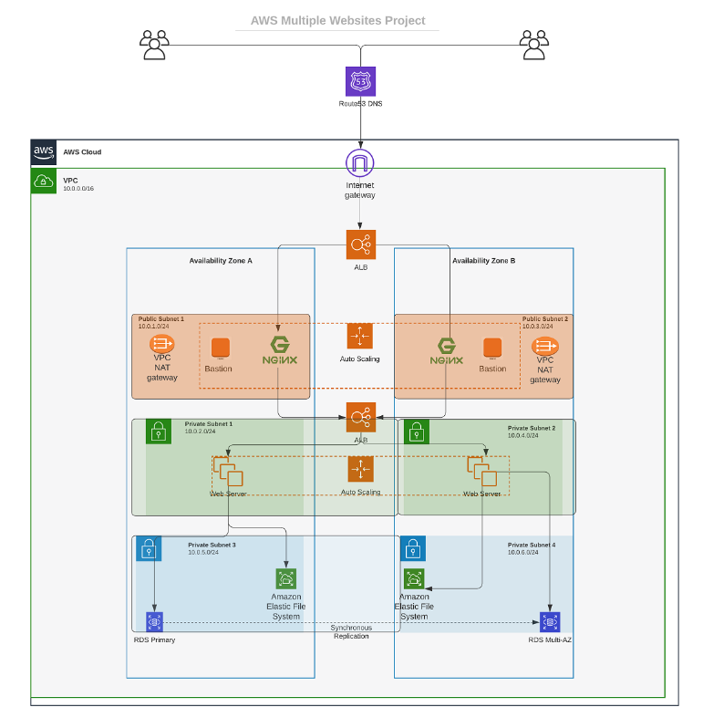

* Make sure we use `variables or length()` function to determine the number of AZs
* Use `variables and cidrsubnet()` function to allocate `vpc_cidr` for subnets
* Keep `variables` and `resources` in separate files for better code structure and readability
* Tags all the `resources` created so far. Explore how to use `format()` and `count` functions to automatically tag subnets with its respective number.

## STEP 1: Creating Private Subnet

* Creating the private subnet

```
# Create private subnets
resource "aws_subnet" "private" {
  count                   = var.preferred_number_of_private_subnets == null ? length(data.aws_availability_zones.available.names) : var.preferred_number_of_private_subnets
  vpc_id                  = aws_vpc.main.id
  cidr_block              = cidrsubnet(var.vpc_cidr, 8, count.index + 2)
  map_public_ip_on_launch = true
  availability_zone       = data.aws_availability_zones.available.names[count.index]
  tags = merge(
    var.tags,
    {
      Name = format("%s-PrivateSubnet-%s", var.name, count.index)
    },
  )

}
```

The following eeror was experienced when I ran the `terraform plan` command because the available number of AZs in the `eu-west-2` region is 3 and not up to 4 which is declared in the `terraformtfvars` file and in the part of the script for subnets as indicated below:


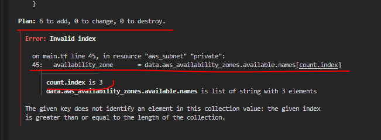

***line 45***: `availability_zone       = data.aws_availability_zones.available.names[count.index]` meaning this line `preferred_number_of_private_subnets == null ? length(data.aws_availability_zones.available.names) : var.preferred_number_of_private_subnets` will not work as required


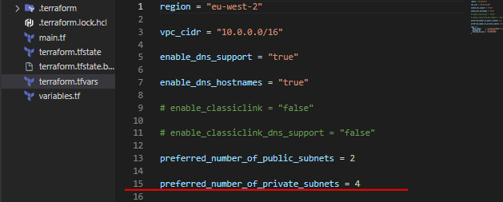

Therefore `random_shuffle` resource is introduced and then specifying the maximum subnet:

Though, as a quick measure during the project I used this line in place of the one in the terraform code:


`length(data.aws_availability_zones.available.names) : length(data.aws_availability_zones.available.names)`

```
resource "random_shuffle" "az_list" {
  input        = data.aws_availability_zones.available.names
  result_count = var.max_subnets
}
```

* Now I added tags to all the resources using the format below:

```
tags = merge(
    var.tags,
    {
      Name = "Name of the resource"
    },
  )
```

***NOTE***: Update the `variables.tf` to declare the variable tags used in the format above:

```
variable "name" {
  type        = string
  default     = "desired name"
}

variable "tags" {
  description = "A mapping of tags to assign to all resources."
  type        = map(string)
  default     = {}
}
```


The nice thing about this is – anytime we need to make a change to the tags, we simply do that in one single place `(terraform.tfvars)`.

But, our key-value pairs are hard coded. So, go ahead and work out a fix for that. Simply create variables for each value and use `var.variable_name` as the value to each of the keys.

Apply the same best practices for all other resources you will create further.


## STEP 2: Creating Internet Gateway


* Create a file called `internet_gateway.tf` and update it with the following codes:

```
resource "aws_internet_gateway" "ig" {
  vpc_id = aws_vpc.main.id
  tags = merge(
    var.tags,
    {
      Name = format("%s-%s-%s!", var.name, aws_vpc.main.id, "IG")
    },
  )

}
```
***Note***: I have used the `format()` function to dynamically generate a unique name for this resource? The first part of the `%s` takes the interpolated value of `aws_vpc.main.id` while the second `%s` appends a literal string `IG` and finally an exclamation mark is added in the end.

If any of the resources being created is either using the `count` function, or creating multiple resources using a `loop`, then a key-value pair that needs to be unique must be handled differently.

## STEP 3: Creating NAT Gateway

* Create a file called `nat_gateway.tf` and update it with the following codes to create a NAT gateway and assign an `elastic IP` to it:

```
resource "aws_eip" "nat_eip" {
  vpc        = true
  depends_on = [aws_internet_gateway.ig]

  tags = merge(
    var.tags,
    {
      Name = format("%s-EIP", var.name)
    },
  )
}

resource "aws_nat_gateway" "nat" {
  allocation_id = aws_eip.nat_eip.id
  subnet_id     = element(aws_subnet.public.*.id, 0)
  depends_on    = [aws_internet_gateway.ig]

  tags = merge(
    var.tags,
    {
      Name = format("%s-Nat", var.name)
    },
  )
}
```


## STEP 4: Creating Routes

* Create a file called `route_tables.tf` and update the following codes to create routes for both public and private subnets:


```
# create private route table
resource "aws_route_table" "private-rtb" {
  vpc_id = aws_vpc.main.id

  tags = merge(
    var.tags,
    {
      Name = format("%s-Private-Route-Table", var.name)
    },
  )
}

# associate all private subnets to the private route table
resource "aws_route_table_association" "private-subnets-assoc" {
  count          = length(aws_subnet.private[*].id)
  subnet_id      = element(aws_subnet.private[*].id, count.index)
  route_table_id = aws_route_table.private-rtb.id
}

# create route table for the public subnets
resource "aws_route_table" "public-rtb" {
  vpc_id = aws_vpc.main.id

  tags = merge(
    var.tags,
    {
      Name = format("%s-Public-Route-Table", var.name)
    },
  )
}

# create route for the public route table and attach the internet gateway
resource "aws_route" "public-rtb-route" {
  route_table_id         = aws_route_table.public-rtb.id
  destination_cidr_block = "0.0.0.0/0"
  gateway_id             = aws_internet_gateway.ig.id
}

# associate all public subnets to the public route table
resource "aws_route_table_association" "public-subnets-assoc" {
  count          = length(aws_subnet.public[*].id)
  subnet_id      = element(aws_subnet.public[*].id, count.index)
  route_table_id = aws_route_table.public-rtb.id
}
```


* Ran `terraform fmt` and `terraform plan`

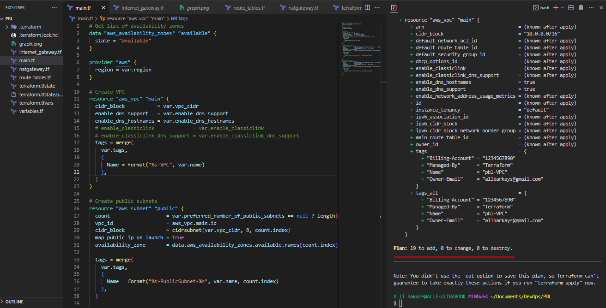

## STEP 5: Creating IAM Roles

An IAM role is passed to the EC2 instances to give them access to some specific resources by first of all creating an `AssumeRole` and `AssumeRole policy`.

* Create a file named `roles.tf` and update with the following codes:

```
resource "aws_iam_role" "ec2_instance_role" {
  name = "ec2_instance_role"
  assume_role_policy = jsonencode({
    Version = "2012-10-17"
    Statement = [
      {
        Action = "sts:AssumeRole"
        Effect = "Allow"
        Sid    = ""
        Principal = {
          Service = "ec2.amazonaws.com"
        }
      },
    ]
  })

  tags = merge(
    var.tags,
    {
      Name = "aws assume role"
    },
  )
}


resource "aws_iam_policy" "policy" {
  name        = "ec2_instance_policy"
  description = "A test policy"
  policy = jsonencode({
    Version = "2012-10-17"
    Statement = [
      {
        Action = [
          "ec2:Describe*",
        ]
        Effect   = "Allow"
        Resource = "*"
      },
    ]

  })

  tags = merge(
    var.tags,
    {
      Name = "aws assume policy"
    },
  )

}


resource "aws_iam_role_policy_attachment" "test-attach" {
  role       = aws_iam_role.ec2_instance_role.name
  policy_arn = aws_iam_policy.policy.arn
}


resource "aws_iam_instance_profile" "ip" {
  name = "aws_instance_profile_test"
  role = aws_iam_role.ec2_instance_role.name
}
```

***breaking the above code down as below***:

* IAM policy which allows an IAM role to perform action describe to EC2 instances:

```
resource "aws_iam_policy" "policy" {
  name        = "ec2_instance_policy"
  description = "A test policy"
  policy = jsonencode({
    Version = "2012-10-17"
    Statement = [
      {
        Action = [
          "ec2:Describe*",
        ]
        Effect   = "Allow"
        Resource = "*"
      },
    ]

  })

  tags = merge(
    var.tags,
    {
      Name = "aws assume policy"
    },
  )

}
```

* Attaching the policy to the IAM role created:

```
resource "aws_iam_role_policy_attachment" "test-attach" {
  role       = aws_iam_role.ec2_instance_role.name
  policy_arn = aws_iam_policy.policy.arn
}
```

* Creating an Instance Profile and interpolating the IAM Role:

```
resource "aws_iam_instance_profile" "ip" {
  name = "aws_instance_profile_test"
  role = aws_iam_role.ec2_instance_role.name
}
```

## STEP 6: Creating Security Groups

* Create a new file called `security.tf` and updated with the following commands to create security group for the `Internal and External load balancer`, the `bastion server`, `Nginx server`, the `tooling and wordpress webservers` and the `data layer`:

```
# security group for alb, to allow acess from any where for HTTP and HTTPS traffic
resource "aws_security_group" "ext-alb-sg" {
  name        = "ext-alb-sg"
  vpc_id      = aws_vpc.main.id
  description = "Allow TLS inbound traffic"

  ingress {
    description = "HTTP"
    from_port   = 80
    to_port     = 80
    protocol    = "tcp"
    cidr_blocks = ["0.0.0.0/0"]
  }

  ingress {
    description = "HTTPS"
    from_port   = 443
    to_port     = 443
    protocol    = "tcp"
    cidr_blocks = ["0.0.0.0/0"]
  }

  egress {
    from_port   = 0
    to_port     = 0
    protocol    = "-1"
    cidr_blocks = ["0.0.0.0/0"]
  }

  tags = merge(
    var.tags,
    {
      Name = "ext-alb-sg"
    },
  )

}

# security group for bastion, to allow access into the bastion host from you IP
resource "aws_security_group" "bastion_sg" {
  name        = "bastion_sg"
  vpc_id      = aws_vpc.main.id
  description = "Allow incoming HTTP connections."

  ingress {
    description = "SSH"
    from_port   = 22
    to_port     = 22
    protocol    = "tcp"
    cidr_blocks = ["0.0.0.0/0"]
  }

  egress {
    from_port   = 0
    to_port     = 0
    protocol    = "-1"
    cidr_blocks = ["0.0.0.0/0"]
  }

  tags = merge(
    var.tags,
    {
      Name = "Bastion-SG"
    },
  )
}

#security group for nginx reverse proxy, to allow access only from the extaernal load balancer and bastion instance
resource "aws_security_group" "nginx-sg" {
  name   = "nginx-sg"
  vpc_id = aws_vpc.main.id

  egress {
    from_port   = 0
    to_port     = 0
    protocol    = "-1"
    cidr_blocks = ["0.0.0.0/0"]
  }

  tags = merge(
    var.tags,
    {
      Name = "nginx-SG"
    },
  )
}

resource "aws_security_group_rule" "inbound-nginx-http" {
  type                     = "ingress"
  from_port                = 443
  to_port                  = 443
  protocol                 = "tcp"
  source_security_group_id = aws_security_group.ext-alb-sg.id
  security_group_id        = aws_security_group.nginx-sg.id
}

resource "aws_security_group_rule" "inbound-bastion-ssh" {
  type                     = "ingress"
  from_port                = 22
  to_port                  = 22
  protocol                 = "tcp"
  source_security_group_id = aws_security_group.bastion_sg.id
  security_group_id        = aws_security_group.nginx-sg.id
}

# security group for ialb, to have acces only from nginx reverser proxy server
resource "aws_security_group" "int-alb-sg" {
  name   = "my-alb-sg"
  vpc_id = aws_vpc.main.id

  egress {
    from_port   = 0
    to_port     = 0
    protocol    = "-1"
    cidr_blocks = ["0.0.0.0/0"]
  }

  tags = merge(
    var.tags,
    {
      Name = "int-alb-sg"
    },
  )

}

resource "aws_security_group_rule" "inbound-ialb-https" {
  type                     = "ingress"
  from_port                = 443
  to_port                  = 443
  protocol                 = "tcp"
  source_security_group_id = aws_security_group.nginx-sg.id
  security_group_id        = aws_security_group.int-alb-sg.id
}

# security group for webservers, to have access only from the internal load balancer and bastion instance
resource "aws_security_group" "webserver-sg" {
  name   = "webserver-sg"
  vpc_id = aws_vpc.main.id

  egress {
    from_port   = 0
    to_port     = 0
    protocol    = "-1"
    cidr_blocks = ["0.0.0.0/0"]
  }

  tags = merge(
    var.tags,
    {
      Name = "webserver-sg"
    },
  )

}

resource "aws_security_group_rule" "inbound-web-https" {
  type                     = "ingress"
  from_port                = 443
  to_port                  = 443
  protocol                 = "tcp"
  source_security_group_id = aws_security_group.int-alb-sg.id
  security_group_id        = aws_security_group.webserver-sg.id
}

resource "aws_security_group_rule" "inbound-web-ssh" {
  type                     = "ingress"
  from_port                = 22
  to_port                  = 22
  protocol                 = "tcp"
  source_security_group_id = aws_security_group.bastion_sg.id
  security_group_id        = aws_security_group.webserver-sg.id
}

# security group for datalayer to alow traffic from websever on nfs and mysql port and bastiopn host on mysql port
resource "aws_security_group" "datalayer-sg" {
  name   = "datalayer-sg"
  vpc_id = aws_vpc.main.id

  egress {
    from_port   = 0
    to_port     = 0
    protocol    = "-1"
    cidr_blocks = ["0.0.0.0/0"]
  }

  tags = merge(
    var.tags,
    {
      Name = "datalayer-sg"
    },
  )
}

resource "aws_security_group_rule" "inbound-nfs-port" {
  type                     = "ingress"
  from_port                = 2049
  to_port                  = 2049
  protocol                 = "tcp"
  source_security_group_id = aws_security_group.webserver-sg.id
  security_group_id        = aws_security_group.datalayer-sg.id
}

resource "aws_security_group_rule" "inbound-mysql-bastion" {
  type                     = "ingress"
  from_port                = 3306
  to_port                  = 3306
  protocol                 = "tcp"
  source_security_group_id = aws_security_group.bastion_sg.id
  security_group_id        = aws_security_group.datalayer-sg.id
}

resource "aws_security_group_rule" "inbound-mysql-webserver" {
  type                     = "ingress"
  from_port                = 3306
  to_port                  = 3306
  protocol                 = "tcp"
  source_security_group_id = aws_security_group.webserver-sg.id
  security_group_id        = aws_security_group.datalayer-sg.id
}
```

## STEP 7: Creating Certificate From Amazon Certificate Manager

* Create a new file called `cert.tf` and update with the following codes to create and validate a `certificate` in AWS:

```
# The entire section create a certiface, public zone, and validate the certificate using DNS method

# Create the certificate using a wildcard for all the domains created in oyindamola.gq
resource "aws_acm_certificate" "allbarkays" {
  domain_name       = "*.allbarkays.click"
  validation_method = "DNS"
}

# calling the hosted zone
data "aws_route53_zone" "allbarkays" {
  name         = "allbarkays.click"
  private_zone = false
}

# selecting validation method
resource "aws_route53_record" "allbarkays" {
  for_each = {
    for dvo in aws_acm_certificate.allbarkays.domain_validation_options : dvo.domain_name => {
      name   = dvo.resource_record_name
      record = dvo.resource_record_value
      type   = dvo.resource_record_type
    }
  }

  allow_overwrite = true
  name            = each.value.name
  records         = [each.value.record]
  ttl             = 60
  type            = each.value.type
  zone_id         = data.aws_route53_zone.allbarkays.zone_id
}

# validate the certificate through DNS method
resource "aws_acm_certificate_validation" "allbarkays" {
  certificate_arn         = aws_acm_certificate.allbarkays.arn
  validation_record_fqdns = [for record in aws_route53_record.allbarkays : record.fqdn]
}

# create records for tooling
resource "aws_route53_record" "tooling" {
  zone_id = data.aws_route53_zone.allbarkays.zone_id
  name    = "tooling.allbarkays.click"
  type    = "A"

  alias {
    name                   = aws_lb.ext-alb.dns_name
    zone_id                = aws_lb.ext-alb.zone_id
    evaluate_target_health = true
  }
}

# create records for wordpress
resource "aws_route53_record" "wordpress" {
  zone_id = data.aws_route53_zone.allbarkays.zone_id
  name    = "wordpress.allbarkays.click"
  type    = "A"

  alias {
    name                   = aws_lb.ext-alb.dns_name
    zone_id                = aws_lb.ext-alb.zone_id
    evaluate_target_health = true
  }
}
```

## STEP 8: Creating Application Load Balancer and Target Groups

* Create a file called `alb.tf` and update with the following codes to create `external(internet-facing) load balancer` which balances traffic for the Nginx servers:

```
# create an ALB to balance the traffic between the Instances

resource "aws_lb" "ext-alb" {
  name     = "ext-alb"
  internal = false
  security_groups = [
    aws_security_group.ext-alb-sg.id,
  ]

  subnets = [
    aws_subnet.public[0].id,
    aws_subnet.public[1].id
  ]

  tags = merge(
    var.tags,
    {
      Name = "pbl-ext-alb"
    },
  )

  ip_address_type    = "ipv4"
  load_balancer_type = "application"
}


# ----------------------------
#Internal Load Balancers for webservers
#---------------------------------

resource "aws_lb" "ialb" {
  name     = "ialb"
  internal = true
  security_groups = [
    aws_security_group.int-alb-sg.id,
  ]

  subnets = [
    aws_subnet.private[0].id,
    aws_subnet.private[1].id
  ]

  tags = merge(
    var.tags,
    {
      Name = "pbl-int-alb"
    },
  )

  ip_address_type    = "ipv4"
  load_balancer_type = "application"
}


# Create Target group to point its targets

resource "aws_lb_target_group" "nginx-tgt" {
  health_check {
    interval            = 10
    path                = "/healthstatus"
    protocol            = "HTTPS"
    timeout             = 5
    healthy_threshold   = 5
    unhealthy_threshold = 2
  }
  name        = "nginx-tgt"
  port        = 443
  protocol    = "HTTPS"
  target_type = "instance"
  vpc_id      = aws_vpc.main.id
}

# --- target group  for wordpress -------

resource "aws_lb_target_group" "wordpress-tgt" {
  health_check {
    interval            = 10
    path                = "/healthstatus"
    protocol            = "HTTPS"
    timeout             = 5
    healthy_threshold   = 5
    unhealthy_threshold = 2
  }

  name        = "wordpress-tgt"
  port        = 443
  protocol    = "HTTPS"
  target_type = "instance"
  vpc_id      = aws_vpc.main.id
}

# --- target group for tooling -------

resource "aws_lb_target_group" "tooling-tgt" {
  health_check {
    interval            = 10
    path                = "/healthstatus"
    protocol            = "HTTPS"
    timeout             = 5
    healthy_threshold   = 5
    unhealthy_threshold = 2
  }

  name        = "tooling-tgt"
  port        = 443
  protocol    = "HTTPS"
  target_type = "instance"
  vpc_id      = aws_vpc.main.id
}


# create a Listner for the target Group

resource "aws_lb_listener" "nginx-listner" {
  load_balancer_arn = aws_lb.ext-alb.arn
  port              = 443
  protocol          = "HTTPS"
  certificate_arn   = aws_acm_certificate_validation.allbarkays.certificate_arn

  default_action {
    type             = "forward"
    target_group_arn = aws_lb_target_group.nginx-tgt.arn
  }
}


# For this aspect a single listener was created for the wordpress which is default,
# A rule was created to route traffic to tooling when the host header changes

resource "aws_lb_listener" "web-listener" {
  load_balancer_arn = aws_lb.ialb.arn
  port              = 443
  protocol          = "HTTPS"
  certificate_arn   = aws_acm_certificate_validation.allbarkays.certificate_arn

  default_action {
    type             = "forward"
    target_group_arn = aws_lb_target_group.wordpress-tgt.arn
  }
}

# listener rule for tooling target

resource "aws_lb_listener_rule" "tooling-listener" {
  listener_arn = aws_lb_listener.web-listener.arn
  priority     = 99

  action {
    type             = "forward"
    target_group_arn = aws_lb_target_group.tooling-tgt.arn
  }

  condition {
    host_header {
      values = ["tooling.allbarkays.click"]
    }
  }
}
```

* ***Also add the following code to `output.tf` to print them on screen when the `terraform plan` is ran***

```
output "alb_dns_name" {
  value = aws_lb.ext-alb.dns_name
}

output "alb_target_group_arn" {
  value = aws_lb_target_group.nginx-tgt.arn
}
```

## STEP 9: Creating An Auto Scaling Group

* Create a file called `asg-bastion-nginx.tf` to be used to create an auto scaling group for the `bastion` and the `Nginx` servers.
* Update it with the following codes which creates `notification` for all the auto scaling group:

```
#### creating sns topic for all the auto scaling groups
resource "aws_sns_topic" "alli-sns" {
  name = "Default_CloudWatch_Alarms_Topic"
}

# creating notification for all the auto scaling groups

resource "aws_autoscaling_notification" "alli_notifications" {
  group_names = [
    aws_autoscaling_group.bastion-asg.name,
    aws_autoscaling_group.nginx-asg.name,
    aws_autoscaling_group.wordpress-asg.name,
    aws_autoscaling_group.tooling-asg.name,
  ]
  notifications = [
    "autoscaling:EC2_INSTANCE_LAUNCH",
    "autoscaling:EC2_INSTANCE_TERMINATE",
    "autoscaling:EC2_INSTANCE_LAUNCH_ERROR",
    "autoscaling:EC2_INSTANCE_TERMINATE_ERROR",
  ]

  topic_arn = aws_sns_topic.alli-sns.arn
}

resource "random_shuffle" "az_list" {
  input = data.aws_availability_zones.available.names
}

resource "aws_launch_template" "bastion-launch-template" {
  image_id               = var.ami
  instance_type          = "t2.micro"
  vpc_security_group_ids = [aws_security_group.bastion_sg.id]

  iam_instance_profile {
    name = aws_iam_instance_profile.ip.id
  }

  key_name = var.keypair

  placement {
    availability_zone = "$(random_shuffle.az_list.result)"
  }

  lifecycle {
    create_before_destroy = true
  }

  tag_specifications {
    resource_type = "instance"

    tags = merge(
      var.tags,
      {
        Name = "bastion-launch-template"
      },
    )
  }

  user_data = filebase64("${path.module}/bastion.sh")
}

# ---- Autoscaling for bastion  hosts

resource "aws_autoscaling_group" "bastion-asg" {
  name                      = "bastion-asg"
  max_size                  = 2
  min_size                  = 2
  health_check_grace_period = 300
  health_check_type         = "ELB"
  desired_capacity          = 2

  vpc_zone_identifier = [
    aws_subnet.public[0].id,
    aws_subnet.public[1].id
  ]

  launch_template {
    id      = aws_launch_template.bastion-launch-template.id
    version = "$Latest"
  }
  tag {
    key                 = "Name"
    value               = "pbl-bastion"
    propagate_at_launch = true
  }

}

# launch template for nginx

resource "aws_launch_template" "nginx-launch-template" {
  image_id               = var.ami
  instance_type          = "t2.micro"
  vpc_security_group_ids = [aws_security_group.nginx-sg.id]

  iam_instance_profile {
    name = aws_iam_instance_profile.ip.id
  }

  key_name = var.keypair

  placement {
    availability_zone = "random_shuffle.az_list.result"
  }

  lifecycle {
    create_before_destroy = true
  }

  tag_specifications {
    resource_type = "instance"

    tags = merge(
      var.tags,
      {
        Name = "nginx-launch-template"
      },
    )
  }

  user_data = filebase64("${path.module}/nginx.sh")
}

# ------ Autoscslaling group for reverse proxy nginx ---------

resource "aws_autoscaling_group" "nginx-asg" {
  name                      = "nginx-asg"
  max_size                  = 2
  min_size                  = 1
  health_check_grace_period = 300
  health_check_type         = "ELB"
  desired_capacity          = 1

  vpc_zone_identifier = [
    aws_subnet.public[0].id,
    aws_subnet.public[1].id
  ]

  launch_template {
    id      = aws_launch_template.nginx-launch-template.id
    version = "$Latest"
  }

  tag {
    key                 = "Name"
    value               = "pbl-nginx"
    propagate_at_launch = true
  }

}

# attaching autoscaling group of nginx to external load balancer
resource "aws_autoscaling_attachment" "asg_attachment_nginx" {
  autoscaling_group_name = aws_autoscaling_group.nginx-asg.id
  alb_target_group_arn   = aws_lb_target_group.nginx-tgt.arn
}
```

* Create a new file called `asg-wordpress-tooling.tf` and update in it the following codes which creates `launch templates` and `Auto Scaling Group` for both the `wordpress and tooling webservers`:

```
# launch template for wordpress

resource "aws_launch_template" "wordpress-launch-template" {
  image_id               = var.ami
  instance_type          = "t2.micro"
  vpc_security_group_ids = [aws_security_group.webserver-sg.id]

  iam_instance_profile {
    name = aws_iam_instance_profile.ip.id
  }

  key_name = var.keypair

  placement {
    availability_zone = "$(random_shuffle.az_list.result)"
  }

  lifecycle {
    create_before_destroy = true
  }

  tag_specifications {
    resource_type = "instance"

    tags = merge(
      var.tags,
      {
        Name = "wordpress-launch-template"
      },
    )

  }

  user_data = filebase64("${path.module}/wordpress.sh")
}

# ---- Autoscaling for wordpress application

resource "aws_autoscaling_group" "wordpress-asg" {
  name                      = "wordpress-asg"
  max_size                  = 2
  min_size                  = 1
  health_check_grace_period = 300
  health_check_type         = "ELB"
  desired_capacity          = 1
  vpc_zone_identifier = [

    aws_subnet.private[0].id,
    aws_subnet.private[1].id
  ]

  launch_template {
    id      = aws_launch_template.wordpress-launch-template.id
    version = "$Latest"
  }
  tag {
    key                 = "Name"
    value               = "pbl-wordpress"
    propagate_at_launch = true
  }
}

# attaching autoscaling group of  wordpress application to internal loadbalancer
resource "aws_autoscaling_attachment" "asg_attachment_wordpress" {
  autoscaling_group_name = aws_autoscaling_group.wordpress-asg.id
  alb_target_group_arn   = aws_lb_target_group.wordpress-tgt.arn
}

# launch template for toooling
resource "aws_launch_template" "tooling-launch-template" {
  image_id               = var.ami
  instance_type          = "t2.micro"
  vpc_security_group_ids = [aws_security_group.webserver-sg.id]

  iam_instance_profile {
    name = aws_iam_instance_profile.ip.id
  }

  key_name = var.keypair

  placement {
    availability_zone = "$(random_shuffle.az_list.result)"
  }

  lifecycle {
    create_before_destroy = true
  }

  tag_specifications {
    resource_type = "instance"

    tags = merge(
      var.tags,
      {
        Name = "tooling-launch-template"
      },
    )

  }

  user_data = filebase64("${path.module}/tooling.sh")
}

# ---- Autoscaling for tooling -----

resource "aws_autoscaling_group" "tooling-asg" {
  name                      = "tooling-asg"
  max_size                  = 2
  min_size                  = 1
  health_check_grace_period = 300
  health_check_type         = "ELB"
  desired_capacity          = 1

  vpc_zone_identifier = [

    aws_subnet.private[0].id,
    aws_subnet.private[1].id
  ]

  launch_template {
    id      = aws_launch_template.tooling-launch-template.id
    version = "$Latest"
  }

  tag {
    key                 = "Name"
    value               = "pbl-tooling"
    propagate_at_launch = true
  }
}


# attaching autoscaling group of  tooling application to internal loadbalancer
resource "aws_autoscaling_attachment" "asg_attachment_tooling" {
  autoscaling_group_name = aws_autoscaling_group.tooling-asg.id
  alb_target_group_arn   = aws_lb_target_group.tooling-tgt.arn
}
```

## STEP 10. Create files for user data

* Create four files named against the respective servers below to be used as user data to launch the four servers in this project:

1. Bastion (`bastion.sh`)
2. Nginx (`nginx.sh`)
3. Wordpress (`wordpress.sh`)
4. Tooling (`tooling.sh`)

### for `bastion.sh`

```
#!/bin/bash 
yum install -y mysql 
yum install -y git tmux 
yum install -y ansible
```

### for `nginx.sh`

```
#!/bin/bash

cd ~
sudo yum install -y nginx
sudo systemctl start nginx
sudo systemctl enable nginx
sudo git clone https://github.com/allbarkays/pbl-Project-Configuration.git
sudo cp RCR-Project-Configuration/reverseProxy.conf /etc/nginx/
sudo mv /etc/nginx/nginx.conf /etc/nginx/nginx.conf-distro
cd /etc/nginx/
sudo touch nginx.conf
sudo sed -n 'w nginx.conf' reverseProxy.conf
sudo systemctl restart nginx
sudo rm -rf reverseProxy.conf
```

### for `wordpress.sh`

```
#!/bin/bash
mkdir /var/www/
sudo mount -t efs -o tls,accesspoint=fsap-001f1cb7432271a8b fs-0a487970ca2f2d267:/ /var/www/
yum install -y httpd 
systemctl start httpd
systemctl enable httpd
yum module reset php -y
yum module enable php:remi-7.4 -y
yum install -y php php-common php-mbstring php-opcache php-intl php-xml php-gd php-curl php-mysqlnd php-fpm php-json
systemctl start php-fpm
systemctl enable php-fpm
wget http://wordpress.org/latest.tar.gz
tar xzvf latest.tar.gz
rm -rf latest.tar.gz
cp wordpress/wp-config-sample.php wordpress/wp-config.php
mkdir /var/www/html/
cp -R /wordpress/* /var/www/html/
cd /var/www/html/
touch healthstatus
sed -i "s/localhost/tcs-database.cgk2jcnauxqt.us-east-2.rds.amazonaws.com/g" wp-config.php 
sed -i "s/username_here/TCSadmin/g" wp-config.php 
sed -i "s/password_here/1234567890/g" wp-config.php 
sed -i "s/database_name_here/wordpressdb/g" wp-config.php 
chcon -t httpd_sys_rw_content_t /var/www/html/ -R
systemctl restart httpd
```

### for `tooling.sh`

```
#!/bin/bash
mkdir /var/www/
sudo mount -t efs -o tls,accesspoint=fsap-0044c4bc467c71528 fs-0a487970ca2f2d267:/ /var/www/
yum install -y httpd 
systemctl start httpd
systemctl enable httpd
yum module reset php -y
yum module enable php:remi-7.4 -y
yum install -y php php-common php-mbstring php-opcache php-intl php-xml php-gd php-curl php-mysqlnd php-fpm php-json
systemctl start php-fpm
systemctl enable php-fpm
git clone https://github.com/allbarkays/tooling.git
mkdir /var/www/html
cp -R /tooling/html/*  /var/www/html/
cd /tooling
mysql -h rcr-dbmysql.crvnhmpyxtuf.us-east-1.rds.amazonaws.com -u admin -p toolingdb < tooling-db.sql
cd /var/www/html/
touch healthstatus
sed -i "s/$db = mysqli_connect('172.31.32.49', 'webaccess', 'password', 'tooling');/$db = mysqli_connect('tcs-database.cgk2jcnauxqt.us-east-2.rds.amazonaws.com', 'TCSadmin', '1234567890', 'toolingdb');/g" functions.php
chcon -t httpd_sys_rw_content_t /var/www/html/ -R
systemctl restart httpd
```

***Note***: This scripts are not necessarily called on now as we have not yet updated the correct values to be user (e. AMI for the instances). At the moment, we have used the variable `var.ami` and added a default value in the `terraform.tfvars` file. We are still more concerned about setting up the infrastructure and not necessarily its functionalty.


* Ran `terraform fmt` and `terraform plan`

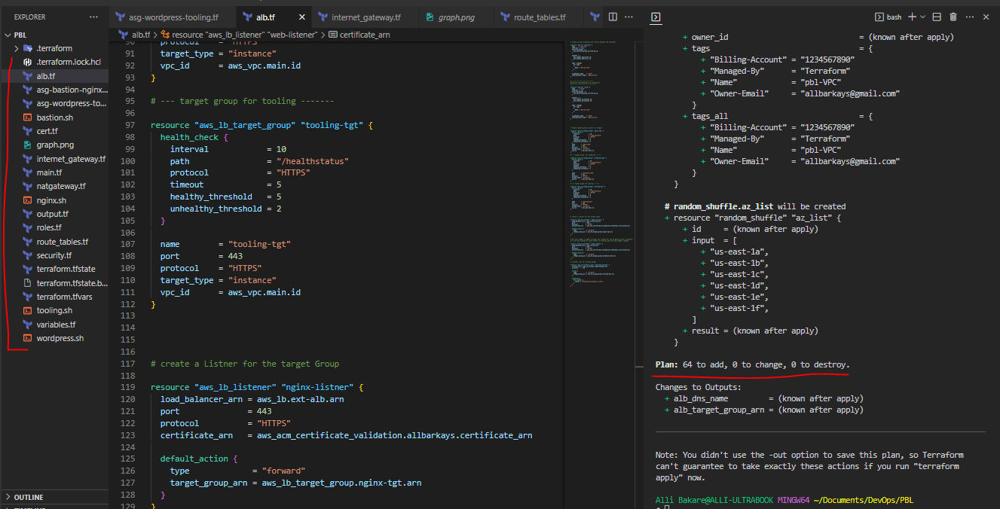

* And then, `terraform apply --auto-approve`


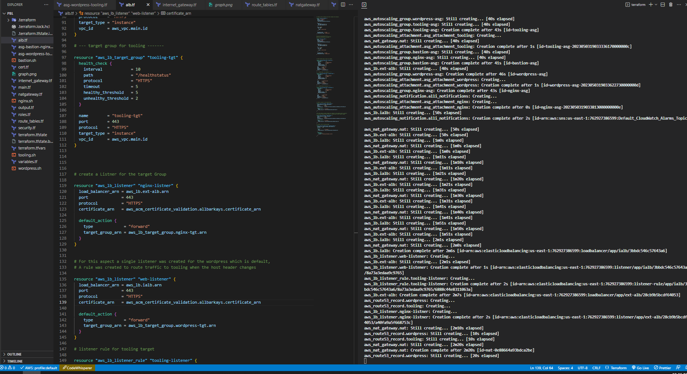


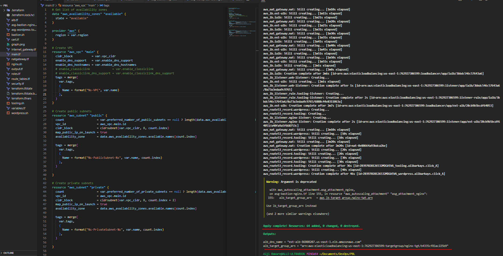

## STEP 11: Creating Database and EFS Resources

* Create a new file called `efs.tf` and update it with the following code to create `KMS key` to encrypt `EFS` resource:

```
# create key from key management system
resource "aws_kms_key" "pbl-kms" {
  description = "KMS key "
  policy      = <<EOF
  {
  "Version": "2012-10-17",
  "Id": "kms-key-policy",
  "Statement": [
    {
      "Sid": "Enable IAM User Permissions",
      "Effect": "Allow",
      "Principal": { "AWS": "arn:aws:iam::${var.account_no}:user/terraform" },
      "Action": "kms:*",
      "Resource": "*"
    }
  ]
}
EOF
}

# create key alias
resource "aws_kms_alias" "alias" {
  name          = "alias/kms"
  target_key_id = aws_kms_key.pbl-kms.key_id
}


# create Elastic file system
resource "aws_efs_file_system" "pbl-efs" {
  encrypted  = true
  kms_key_id = aws_kms_key.pbl-kms.arn

  tags = merge(
    var.tags,
    {
      Name = "pbl-efs"
    },
  )
}

# set first mount target for the EFS 
resource "aws_efs_mount_target" "subnet-1" {
  file_system_id  = aws_efs_file_system.pbl-efs.id
  subnet_id       = aws_subnet.private[2].id
  security_groups = [aws_security_group.datalayer-sg.id]
}

# set second mount target for the EFS 
resource "aws_efs_mount_target" "subnet-2" {
  file_system_id  = aws_efs_file_system.pbl-efs.id
  subnet_id       = aws_subnet.private[3].id
  security_groups = [aws_security_group.datalayer-sg.id]
}

# create access point for wordpress
resource "aws_efs_access_point" "wordpress" {
  file_system_id = aws_efs_file_system.pbl-efs.id

  posix_user {
    gid = 0
    uid = 0
  }

  root_directory {
    path = "/wordpress"

    creation_info {
      owner_gid   = 0
      owner_uid   = 0
      permissions = 0755
    }

  }

}

# create access point for tooling
resource "aws_efs_access_point" "tooling" {
  file_system_id = aws_efs_file_system.pbl-efs.id
  posix_user {
    gid = 0
    uid = 0
  }

  root_directory {

    path = "/tooling"

    creation_info {
      owner_gid   = 0
      owner_uid   = 0
      permissions = 0755
    }
  }
}
  
```
* Create a new file called `rds.tf` and update in it the following code to create `MySQL Relational Database System` **(RDS)**:

```
# This section will create the subnet group for the RDS  instance using the private subnet
resource "aws_db_subnet_group" "pbl-rds" {
  name       = "pbl-rds"
  subnet_ids = [aws_subnet.private[2].id, aws_subnet.private[3].id]

  tags = merge(
    var.tags,
    {
      Name = "pbl-rds"
    },
  )
}

# create the RDS instance with the subnets group

resource "aws_db_instance" "pbl-rds" {
  allocated_storage      = 20
  storage_type           = "gp2"
  engine                 = "mysql"
  engine_version         = "5.7"
  instance_class         = "db.t2.micro"
  db_name                = "pbldb"
  username               = var.master-username
  password               = var.master-password
  parameter_group_name   = "default.mysql5.7"
  db_subnet_group_name   = aws_db_subnet_group.pbl-rds.name
  skip_final_snapshot    = true
  vpc_security_group_ids = [aws_security_group.datalayer-sg.id]
  multi_az               = "true"
}
```

***Note that***: As we progress during the project, all the variables referrenced in the resources must be declared in the `variables.tf` file and also have their `default` values declared in the `terraform.tfvars` file. We should now have both files with the contents as shown below:

* ***`variables.tf`***
```
variable "region" {
  default = "eu-west-2"
}

variable "vpc_cidr" {
  default = "172.16.0.0/16"
}

variable "enable_dns_support" {
  default = "true"
}

variable "enable_dns_hostnames" {
  default = "true"
}

variable "enable_classiclink" {
  default = "false"
}

variable "enable_classiclink_dns_support" {
  default = "false"
}

variable "preferred_number_of_public_subnets" {
  type        = number
  description = "Number of public subnets."
}

variable "preferred_number_of_private_subnets" {
  type        = number
  description = "Number of private subnets."
  default     = 4
}


variable "name" {
  type    = string
  default = "pbl"
}

variable "tags" {
  description = "A mapping of tags to assign to all resources."
  type        = map(string)
  default     = {}
}

variable "ami" {
  type        = string
  description = "AMI ID for the launch template."
}

variable "keypair" {
  type        = string
  description = "Keypair for the instances."
}

variable "account_no" {
  type        = number
  description = "AWS account number."
}

variable "master-username" {
  type        = string
  description = "RDS admin username."
}

variable "master-password" {
  type        = string
  description = "RDS admin password."
}
```

* ***`terraform.tfvars`***
```
region = "us-east-1"

vpc_cidr = "10.0.0.0/16"

enable_dns_support = "true"

enable_dns_hostnames = "true"

# enable_classiclink = "false" 

# enable_classiclink_dns_support = "false" 

preferred_number_of_public_subnets = 2

preferred_number_of_private_subnets = 4

ami = "ami-0aa2b7722dc1b5612"

keypair = "keypbl"

account_no = "762927386599"

master-username = "admin"

master-password = "adminadmin"

tags = {
  Owner-Email     = "allbarkays@gmail.com"
  Managed-By      = "Terraform"
  Billing-Account = "1234567890"
}
```

* ***And the `main.tf`***
```
# Get list of availability zones
data "aws_availability_zones" "available" {
  state = "available"
}

provider "aws" {
  region = var.region
}

# Create VPC
resource "aws_vpc" "main" {
  cidr_block           = var.vpc_cidr
  enable_dns_support   = var.enable_dns_support
  enable_dns_hostnames = var.enable_dns_hostnames
  # enable_classiclink             = var.enable_classiclink
  # enable_classiclink_dns_support = var.enable_classiclink_dns_support
  tags = merge(
    var.tags,
    {
      Name = format("%s-VPC", var.name)
    },
  )
}

# Create public subnets
resource "aws_subnet" "public" {
  count                   = var.preferred_number_of_public_subnets == null ? length(data.aws_availability_zones.available.names) : var.preferred_number_of_public_subnets
  vpc_id                  = aws_vpc.main.id
  cidr_block              = cidrsubnet(var.vpc_cidr, 8, count.index)
  map_public_ip_on_launch = true
  availability_zone       = data.aws_availability_zones.available.names[count.index]

  tags = merge(
    var.tags,
    {
      Name = format("%s-PublicSubnet-%s", var.name, count.index)
    },
  )

}

# Create private subnets
resource "aws_subnet" "private" {
  count                   = var.preferred_number_of_private_subnets == null ? length(data.aws_availability_zones.available.names) : var.preferred_number_of_private_subnets
  vpc_id                  = aws_vpc.main.id
  cidr_block              = cidrsubnet(var.vpc_cidr, 8, count.index + 2)
  map_public_ip_on_launch = true
  availability_zone       = data.aws_availability_zones.available.names[count.index]

  tags = merge(
    var.tags,
    {
      Name = format("%s-PrivateSubnet-%s", var.name, count.index)
    },
  )

}
```


## Execute Terraform code

`terraform plan`

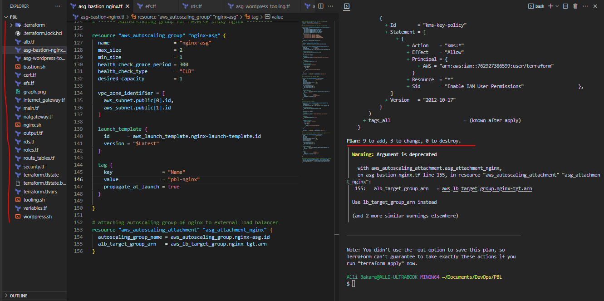

`terraform apply --auto-approve`

* ***Apply running***

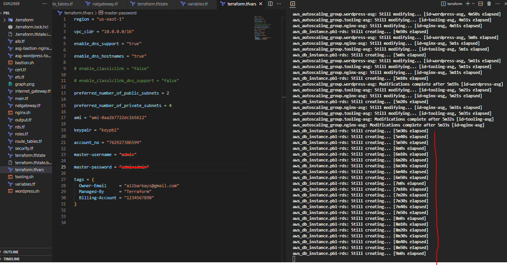

* ***Apply complete***

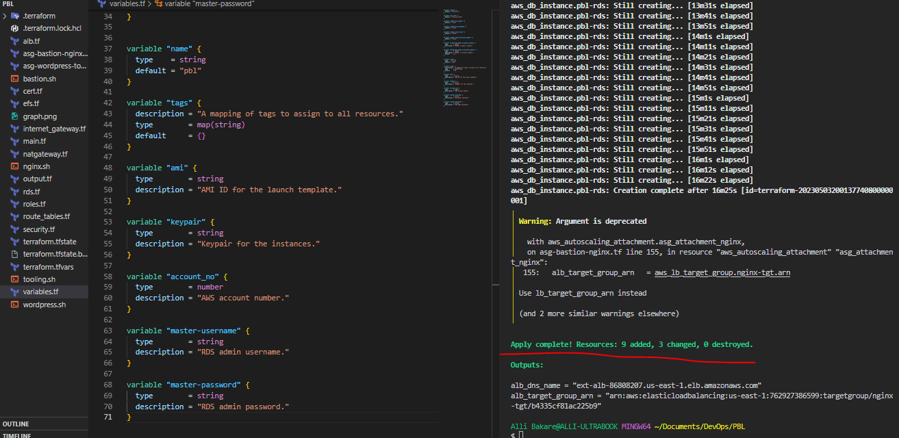

* ***Instances and DB created***

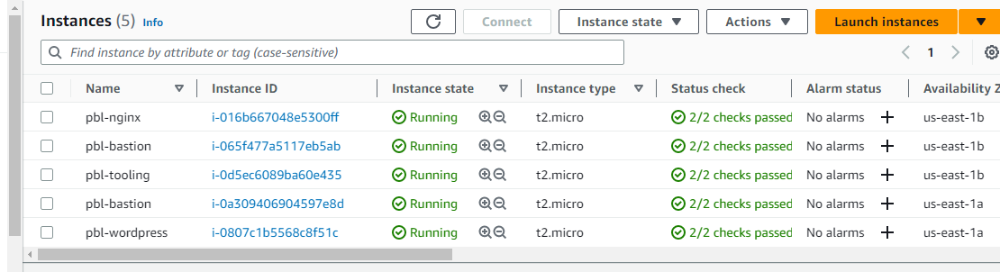

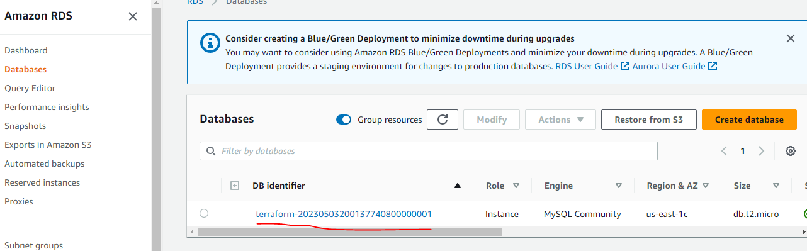

`terraform detroy --auto-approve`

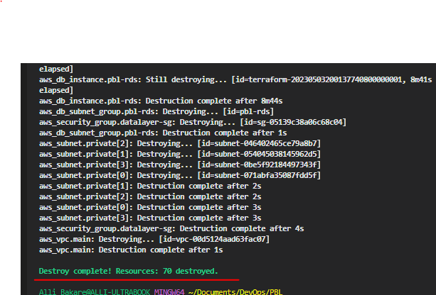


***END OF PROJECT...***
